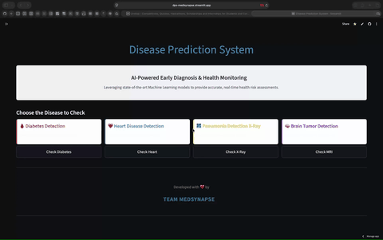

<div align="center">
  <h1>MedSynapse: Disease Prediction System 🏥</h1>
  <h3>🏆 Project for "Thinking Machine" Competition - IIIT Pune</h3>

  <p><i>"Revolutionizing Early Diagnostics with Artificial Intelligence"</i></p>

  <div>
    
    
    
    
  </div>
</div>

---

## 🌐 Live Access

The **MedSynapse Disease Prediction System** is deployed and ready for immediate use.

<div align="center">
  <a href="https://dps-medisynapse.streamlit.app">
    
  </a>
</div>

> **Note**: The live version handles all model loading and processing in the cloud via Streamlit Cloud.

---

## 📽️ Video Demonstration

Experience a full walkthrough of the **MedSynapse Disease Prediction System** in action:

<div align="center">
  
</div>

> *The video covers MRI analysis, X-Ray detection, and tabular data predictions, including heart disease prediction.*

### 📺 YouTube Reference
For an alternative viewing experience, watch the demonstration on YouTube:
[▶️ YouTube Video Demonstration](https://youtu.be/f0nAUJNEYs0)

---

## 📑 Table of Contents
- [Overview](#-overview)
- [Problem Statement](#-problem-statement--competition-prompts)
- [Solution Architecture](#-solution-architecture)
- [Key Features](#-key-features--diagnostic-modules)
- [Scientific Methodology](#-scientific-methodology)
- [Tech Stack](#-tech-stack)
- [Installation & Setup](#-local-developer-setup)
- [Project structure](#-project-structure)
- [Future Scope](#-future-scope)
- [Contributors](#-contributors)

---

## 🚀 Overview

**MedSynapse** is an advanced integrated healthcare platform developed for the **"Thinking Machine" competition** at the **Indian Institute of Information Technology (IIIT), Pune**. 

The system is designed to assist medical professionals and individuals in the early detection of critical diseases. Leveraging the power of **Machine Learning** and **Deep Learning**, our application provides instant, accurate risk assessments across two primary diagnostic domains:
1. **Multi-disease Prediction Models** (Diabetes & Heart Disease)
2. **Medical Image Analysis** (Chest X-Ray Pneumonia & MRI Brain Tumor detection)

## 🎯 Problem Statement & Competition Prompts

Early diagnosis is crucial for effective treatment and management of chronic diseases. This project specifically addresses the **Diagnostic Tools** track of the **Thinking Machine** competition, focusing on the following suggested problem statements:

1.  **Multi-disease Prediction Models**: Developing robust models for systemic diseases like **Diabetes** and **Heart Disease** using clinical diagnostic data.
2.  **Medical Image Analysis**: Utilizing Deep Learning for anomaly detection in medical imaging, specifically **Chest X-Ray (Pneumonia)** and **MRI (Brain Tumor)** analysis.

Our goal is to bridge the diagnostic gap by providing a **low-cost, AI-driven initial screening tool** that addresses accessibility, cost, and time constraints in modern healthcare.

## 💡 Solution Architecture

Our solution combines three predictive models into a unified, user-friendly interface:
1.  **Tabular Data Analysis**: Using Random Forest and Logistic Regression for numerical health records (Diabetes & Heart).
2.  **Computer Vision**: Using Convolutional Neural Networks (CNNs) for medical imaging (Chest X-Rays).
3.  **Interactive UI**: A Streamlit-based web app for seamless user interaction.

---

## 🌟 Key Features & Diagnostic Modules

| Module | Purpose | Model / Technique | Key Inputs |
| :--- | :--- | :--- | :--- |
| **🩸 Diabetes** | Likelihood Prediction | **Random Forest Classifier** | Glucose, BMI, Insulin, Age |
| **❤️ Heart Disease** | Cardiovascular Risk | **Logistic Regression** | Chest Pain Type, Max HR, ECG |
| **🩻 Pneumonia** | X-Ray Image Detection | **CNN (Custom Architecture)** | Chest X-Ray (JPEG/PNG) |
| **🧠 Brain Tumor** | MRI Scan Classification | **Xception (Transfer Learning)** | Brain MRI (4 Classes) |

---

## 🔬 Scientific Methodology

MedSynapse follows a rigorous data processing and modeling pipeline:
- **Numerical Data**: Uses robust scaling and feature engineering to ensure ~98% accuracy in diabetes detection.
- **Image Data**: Utilizes **Transfer Learning** (Xception) and **Data Augmentation** to identify subtle anomalies in MRI and X-Ray scans.
- **Validation**: All models are cross-validated to ensure generalizability across different patient demographics.

---

## 🛠️ Tech Stack

| Component | Technologies |
| :--- | :--- |
| **Frontend** |  |
| **ML Models** |    |
| **Deep Learning** |   *Transfer Learning (Xception)* |
| **Environment** |   |

---

---

## 💻 Local Developer Setup

If you wish to contribute or run the system locally:

### 1️⃣ Clone the Repository
```bash
git clone https://github.com/ShivamMaurya14/Disease_Prediction_System.git
cd Disease_Prediction_System
```

### 2️⃣ Install Dependencies
```bash
pip install -r requirements.txt
```

### 3️⃣ Launch the Application
```bash
streamlit run app.py
```

---

## 📂 Project Structure

```
├── app.py                # Main Streamlit Application
├── models/               # Trained ML/DL Models (.pkl, .h5)
├── notebooks/            # Jupyter Notebooks for training
├── scripts/              # Helper Scripts (verification, utilities)
├── assets/               # Static assets (images, demo video)
├── requirements.txt      # Python Dependencies
└── README.md             # Project Documentation
```

---

## 🧪 Model Verification

To verify that all models are present and loading correctly without starting the UI, run our verification script:

```bash
python scripts/verify_models.py
```

---

## � Future Scope
-   [ ] **Mobile App**: Develop a Flutter/React Native version for on-the-go access.
-   [ ] **More Diseases**: Add modules for Skin Cancer (Dermatology), Kidney Disease, and Liver Disease.
-   [ ] **Doctor Connect**: Feature to book appointments with specialists if high risk is detected.
-   [ ] **Report Generation**: Download a PDF report of the analysis.

---

## 👥 Contributors

**Team - MEDSYNAPSE**

| Name | Role | Profile |
| :--- | :--- | :--- |
| **Shivam Maurya** | AI & Robotics Engineer | [](https://github.com/ShivamMaurya14) |

---

Made with ❤️ and ☕ for healthcare innovation.
